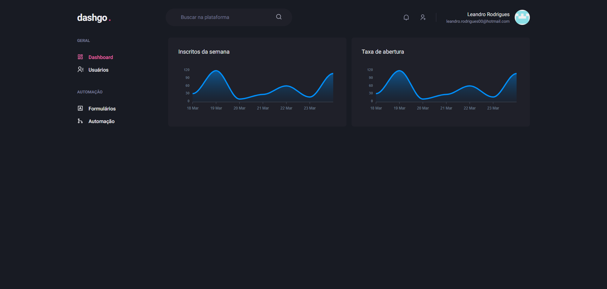

# Dashgo 💜 | Dashboard made with Chakra UI

 


<p align="center">
  <a href="#-about-the-project">About the project</a> •
  <a href="#-technologies">Technologies</a> •
  <a href="#-getting-started">Getting started</a> •
  <a href="#-license">License</a>
</p>

 <p align="center">
  
</p>  

## 💲 About the project

Dashgo is a project created in [Rocketseat](https://rocketseat.com.br/) Ignite ReactJS training.

The idea of the application was the construction of interfaces in NextJs using a front-end library of visual components, the Chakra UI.

[click here, see closer](https://dashgo-nine-zeta.vercel.app/)  😉 


## 🚀 Technologies

- [Typescript](https://www.typescriptlang.org/)
- [React](https://reactjs.org)
- [NextJs](https://nextjs.org/)
- [Chakra UI](https://chakra-ui.com/)

## 💻 Getting started

### Requirements

- [Node.js](https://nodejs.org/en/)
- [Yarn](https://classic.yarnpkg.com/) or [NPM](https://www.npmjs.com/) _(examples are with yarn)_

**Clone the project and access the folder**

```bash
$ git clone https://github.com/leandrorodrigues00/dashgo.git && cd dashgo
```

**Follow the steps below**

```bash
# Install the dependencies
$ yarn

# Start the app
$ yarn start
```

## 📝 License

This project is licensed under the MIT License - see the [LICENSE](LICENSE) file for details.

---

<p align="center">
  Made with 💜&nbsp; by Leandro Rodrigues
</p>
